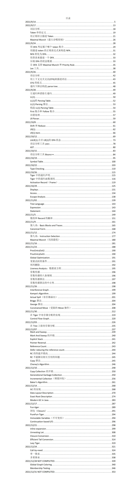

# SE3355-Compliers-2021-Notes

[课程网站](https://ipads.se.sjtu.edu.cn/courses/compilers/)

[我实现的课程配套LAB](https://github.com/Kami-code/SE3355-Compliers-2021-Labs)

课程教材：Modern Compiler Implementation in C（现代编译原理-c语言描述）

## 课程简介
本课程是软件工程专业系统软件方向的一门专业课。它的主要任务是介绍面向程序设计语言的编译程序的基本原理和实现方法。本课程的教学内容包括:编译程序的结构、词法和语法的基本概念、词法分析、语法分析、抽象语法树、语义分析、运行时堆栈空间管理、变量地址分配与访问策略、参数传递策略、面向多目标机器代码的中间代码生成、数据流和控制流分析、寄存器分配、垃圾回收、Java虚拟机、C++语言特性、lambda函数、面向对象等。通过本课程的学习，学生能够掌握面向高级程序设计语言的编译器的基本原理和技术、具有设计实现编译程序的基本技能，能够对对词法和语法分析程序自动生成工具、程序的中间表示、运行时存储管理、代码分析、寄存器分配等基本原理和技术和垃圾回收、语言虚拟机、函数式编程等进阶主题有较深入的了解。

## 更新日志

- 2022/2/7 所有内容更新完毕。

## 说明

- 因为大部分笔记都是课上所记录，不可避免有疏漏之处，包括上课走神可能遗漏知识点。
- 欢迎有愿意分享资料的志愿者同学前往[软院笔记仓库](https://github.com/SJTU-SE/awesome-se-notes)贡献。
- 任何转载请引用这个仓库。

## 目录

